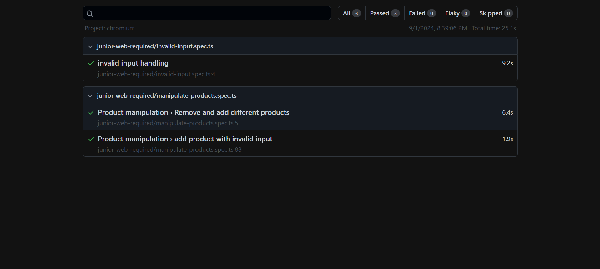

# Project Overview
## [Hosted Frontned URL](http://20.106.235.162:5173/)

## Frontend URL
- [link](https://github.com/mohamed-ahmed-yousef/scandiweb-frontend)

## Tools used
- php
- OOP
- composer
- Docker
- phpstan
    ```sh
      # to use phpstan
      vendor/bin/phpstan analyse src 
    ```


## Project structure
- I use MC folder structure for build php restful api
- use factory design pattern to create products
- make the endpoint in public folder to be accessible from browser
- use PDO to connect to database
- use PDOException to handle errors
- make project meet PSR standards.

## QA Testing Image
- [link](http://165.227.98.170/reports/20-106-235-162-1725215109670/index.html)
- Image
